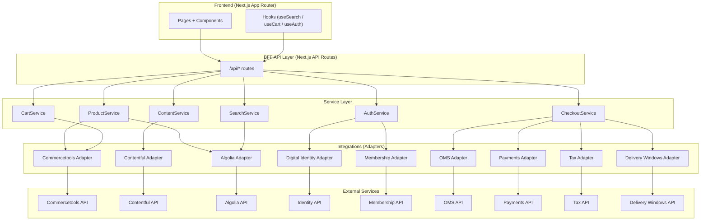

# Integration Status and Architecture

This document summarizes the current application architecture, what is already implemented, and what remains to be integrated for external services.

## Application Diagram (Mermaid)

## Built vs Pending Summary

### Built (Adapter + Service Layer in place)

- Commercetools: adapter and `ProductService`/`CartService` use it when not in mock mode
- Contentful: adapter and `ContentService` exist, but pages still use mock content in places
- Algolia: adapter and `SearchService` exist
- Auth: `AuthService` uses Digital Identity and Membership adapters
- Checkout: `CheckoutService` references OMS, Payments, Tax, Delivery Windows adapters

### Pending (Needs external setup + wiring in UI/API)

#### Contentful (CMS)

- What is missing: Real content types in Contentful, environment variables, and removal of mock content usage
- Real-world implementation:
  - Create Contentful space and content types: `page`, `banner`, `navigationMenu`, `siteSettings`
  - Populate content and validate field mappings in `src/integrations/contentful/*`
  - Replace mock content usage in shop pages with API-backed data
- Files impacted:
  - `src/integrations/contentful/*`
  - `src/services/content.service.ts`
  - `src/app/api/content/*`
  - `src/types/content.ts`
  - Page-level mock content: `src/app/(shop)/help/page.tsx`, `src/app/(shop)/faq/page.tsx`

#### Algolia (Search)

- What is missing: Real Algolia app/index, indexing pipeline, and index settings tuned for facets
- Real-world implementation:
  - Create Algolia app and `products` index
  - Implement indexing job from Commercetools product data (initial + incremental)
  - Ensure index settings match search facets (categories, brand, price)
- Files impacted:
  - `src/integrations/algolia/*`
  - `src/services/search.service.ts`
  - `src/services/product.service.ts`
  - `src/app/api/search/*`
  - `src/hooks/use-search.ts`
  - `src/app/(shop)/search/page.tsx`
  - `src/app/(shop)/products/page.tsx`

#### Commercetools (Commerce)

- What is missing: Real project credentials and end-to-end validation in API routes
- Real-world implementation:
  - Configure Commercetools project and env vars
  - Validate product, category, and cart flows through `/api/products`, `/api/categories`, `/api/cart`
  - Validate checkout cart-to-order flow
- Files impacted:
  - `src/integrations/commercetools/*`
  - `src/services/product.service.ts`
  - `src/services/cart.service.ts`
  - `src/services/checkout.service.ts`
  - `src/app/api/products/*`
  - `src/app/api/categories/*`
  - `src/app/api/cart/*`

#### Digital Identity + Membership (Auth / Loyalty)

- What is missing: Real auth endpoints, token refresh strategy, profile + membership mapping
- Real-world implementation:
  - Configure external identity and membership services
  - Map external user profile to internal `User` shape
  - Implement token refresh and session expiry handling
- Files impacted:
  - `src/integrations/external-apis/digital-identity/*`
  - `src/integrations/external-apis/membership/*`
  - `src/services/auth.service.ts`
  - `src/app/api/auth/*`
  - `src/types/user.ts`
  - `src/hooks/use-auth.ts`

#### Checkout Stack (OMS + Payments + Tax + Delivery Windows)

- What is missing: BFF routes to call `CheckoutService` and finalize checkout
- Real-world implementation:
  - Build `/api/checkout/*` routes (initialize, shipping, delivery windows, payment intent, submit order)
  - Wire checkout UI to those routes and validate end-to-end payment and OMS submission
  - Configure providers for OMS, payment, tax, and delivery windows
- Files impacted:
  - `src/integrations/external-apis/oms-wrapper/*`
  - `src/integrations/external-apis/payments/*`
  - `src/integrations/external-apis/tax/*`
  - `src/integrations/external-apis/delivery-windows/*`
  - `src/services/checkout.service.ts`
  - `src/app/(shop)/checkout/*`
  - `src/app/api/checkout/*` (new)

#### E-Invoice (Regional)

- What is missing: Country adapters beyond Mexico and Costa Rica
- Real-world implementation:
  - Implement adapters for countries that currently throw (PA, CO, CL, PE)
  - Provide env configuration per country and test submissions
- Files impacted:
  - `src/integrations/external-apis/einvoice/*`
  - `src/services/invoice.service.ts`
